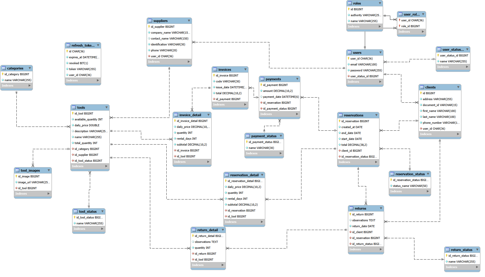

# Plataforma de Renta de Herramientas y Equipos de Construccion - TOLLY

## Descripcion
Sistema backend para gestionar usuarios, herramientas, reservas, pagos, devoluciones y facturacion con autenticacion JWT y control de acceso por roles.

## Autores
- Claudia Tatiana Villamizar Marquez
- Juan David Quiñonez Rojas
- Maicoll Stiven Mendez Cuadros

## Repositorios
- Backend: este repositorio
- Frontend: https://github.com/Killerdav02/tollyFront.git

## Tecnologias Utilizadas
- Java 21
- Spring Boot
- Spring Security + JWT
- Spring Data JPA
- MySQL
- Swagger / OpenAPI

### Frontend
- React 18 + TypeScript (Vite 6)
- Tailwind CSS 4
- MUI (Material UI)
- Radix UI
- React Router

## Requisitos Previos
- JDK 21
- Maven 3.9+
- MySQL 8+

## Instrucciones de Clonado y Ejecucion

### 1. Clonar repositorio
```bash
git clone <https://github.com/Tatii22/TollyApplication.git>
cd TollyApplication
```

### 2. Configurar variables de entorno
```bash
export SPRING_PROFILES_ACTIVE=dev
export DB_URL=jdbc:mysql://localhost:3309/tolly_db?createDatabaseIfNotExist=true&useSSL=false&allowPublicKeyRetrieval=true&serverTimezone=UTC
export DB_USERNAME=root
export DB_PASSWORD=admin
export JWT_SECRET=tu-secreto-seguro
```

### 3. Crear base de datos y datos iniciales (opcional)
Scripts incluidos:
- `docs/sql/schema.sql`
- `docs/sql/seed.sql`

### 4. Instalar dependencias y ejecutar
```bash
mvn clean install
mvn spring-boot:run
```

La aplicacion estara disponible en `http://localhost:8080`

## Ejemplo de application.properties
```properties
spring.datasource.url=jdbc:mysql://localhost:3309/tolly_db?createDatabaseIfNotExist=true&useSSL=false&allowPublicKeyRetrieval=true&serverTimezone=UTC
spring.datasource.username=root
spring.datasource.password=admin

# JWT
jwt.secret=TU_SECRET_KEY
jwt.access-token-expiration=900000
jwt.refresh-token-expiration=604800000

# JPA
spring.jpa.hibernate.ddl-auto=update
spring.jpa.show-sql=false
spring.jpa.properties.hibernate.dialect=org.hibernate.dialect.MySQLDialect

# CORS (ejemplo)
app.cors.allowed-origins=http://localhost:3000
```

## Diagrama Relacional


## Autenticacion y Roles

Header requerido:
```
Authorization: Bearer <token>
```

Roles disponibles:
- `ROLE_ADMIN`
- `ROLE_SUPPLIER`
- `ROLE_CLIENT`
- `ROLE_USER` (rol base)

## Flujo Basico (resumen)
1. Registrar o crear usuario (ADMIN).
2. Autenticarse y obtener JWT.
3. Crear herramientas (SUPPLIER).
4. Crear reserva (CLIENT).
5. Agregar detalles a la reserva.
6. Pagar la reserva (genera factura automaticamente).
7. Descargar factura en HTML o PDF.

## Documentacion Swagger / OpenAPI
Swagger esta habilitado y protegido con JWT para endpoints privados.

- UI: `http://localhost:8080/swagger-ui.html`
- OpenAPI JSON: `http://localhost:8080/v3/api-docs`

Para probar endpoints protegidos en Swagger:
1. Ejecuta `POST /auth/login`
2. Copia el `access_token`
3. En Swagger, pulsa "Authorize" y pega: `Bearer <token>`

## Endpoints Principales (con ejemplos JSON)

### Auth
- `POST /auth/register`
```json
{
  "email": "client1@tolly.com",
  "password": "password123",
  "role": "CLIENT",
  "firstName": "Juan",
  "lastName": "Perez",
  "address": "Calle 1",
  "document": "C001",
  "phone": "3000000001"
}
```

- `POST /auth/login`
```json
{
  "email": "client1@tolly.com",
  "password": "password123"
}
```

### Usuarios (ADMIN)
- `GET /admin/users/list`
- `GET /admin/users/clients`
- `GET /admin/users/suppliers`
- `PUT /admin/users/update`
```json
{
  "email": "client1@tolly.com",
  "phone": "3000009999",
  "status": { "name": "ACTIVE" }
}
```
- `DELETE /admin/users/{userId}`

### Herramientas
- `GET /tools?availableOnly=true&categoryId=1&minPrice=10&maxPrice=50`
- `POST /tools` (SUPPLIER)
```json
{
  "name": "Taladro Dewalt",
  "description": "Taladro 20V",
  "dailyPrice": 25.5,
  "totalQuantity": 10,
  "availableQuantity": 10,
  "categoryId": 1
}
```
- `PUT /tools/{id}` (SUPPLIER)

### Reservas
- `POST /api/reservations` (CLIENT)
```json
{
  "startDate": "2026-02-05",
  "endDate": "2026-02-10",
  "totalPrice": 150000.00
}
```
- `PUT /api/reservations/{id}/cancel` (CLIENT)
- `PUT /api/reservations/{id}/finish` (SUPPLIER/ADMIN)
- `PUT /api/reservations/{id}/incident` (SUPPLIER/ADMIN)

### Detalles de Reserva
- `POST /api/reservations/details?reservationId=1&toolId=2&quantity=1`
- `GET /api/reservations/details/reservation/{reservationId}`

### Pagos
- `POST /payments/reservation/{reservationId}/pay`
- `GET /payments/reservation/{reservationId}`
- `GET /payments/client/{clientId}`
- `GET /payments/supplier/{supplierId}?from=2026-02-01T00:00:00&to=2026-02-07T23:59:59`
- `GET /payments/search?from=2026-02-01T00:00:00&to=2026-02-07T23:59:59&status=PAID` (ADMIN)

### Facturas
- `GET /invoices/{invoiceId}`
- `GET /invoices/payment/{paymentId}`
- `GET /invoices/{invoiceId}/pdf`
- `GET /invoices/{invoiceId}/html`
- `GET /invoices/client/{clientId}`

### Devoluciones
- `POST /returns` (CLIENT)
- `PUT /returns/{id}/confirm` (CLIENT)
- `PUT /returns/{id}/receive` (SUPPLIER/ADMIN)

### Reportes (ADMIN)
- `GET /admin/reports/income`
- `GET /admin/reports/top-tools`
- `GET /admin/reports/frequent-clients`
- `GET /admin/reports/availability`
- `GET /admin/reports/rentals`

## Estructura del Proyecto
```text
TollyApplication/
├─ docs/
│  ├─ diagrams/
│  │  └─ diagramaFinal.png
│  └─ sql/
│     ├─ schema.sql
│     └─ seed.sql
├─ src/
│  ├─ main/
│  │  ├─ java/com/rentaherramientas/tolly/
│  │  │  ├─ application/
│  │  │  │  ├─ dto/
│  │  │  │  ├─ mapper/
│  │  │  │  ├─ service/
│  │  │  │  └─ usecase/
│  │  │  ├─ domain/
│  │  │  │  ├─ exceptions/
│  │  │  │  ├─ model/
│  │  │  │  └─ ports/
│  │  │  └─ infrastructure/
│  │  │     ├─ config/
│  │  │     ├─ exception/
│  │  │     ├─ persistence/
│  │  │     │  ├─ adapters/in/rest/
│  │  │     │  ├─ adapters/out/persistence/
│  │  │     │  ├─ entity/
│  │  │     │  └─ repository/
│  │  │     └─ security/
│  │  └─ resources/
│  │     └─ application.yml
│  └─ test/
│     ├─ java/com/rentaherramientas/tolly/
│     └─ resources/
├─ pom.xml
└─ README.md
```

## Frontend (Ejecucion local)
```bash
npm install
npm run dev
```

Configuracion del backend (API) en el repo frontend:
`http://localhost:8080` (definido en el archivo `.env`).

## Scripts SQL
Los scripts de base de datos estan en:
- `docs/sql/schema.sql`
- `docs/sql/seed.sql`

## Notas Importantes
- El pago se crea automaticamente en estado `PENDIENTE_DEVOLUCION` al crear la reserva.
- La factura se genera cuando se paga la reserva.
- Para que la factura exista, la reserva debe tener detalles.

## Pruebas

### Unitarias
```bash
mvn test
```

### Integracion (ejemplo)
```bash
mvn -Dtest=ReturnFlowIntegrationTest test
```
